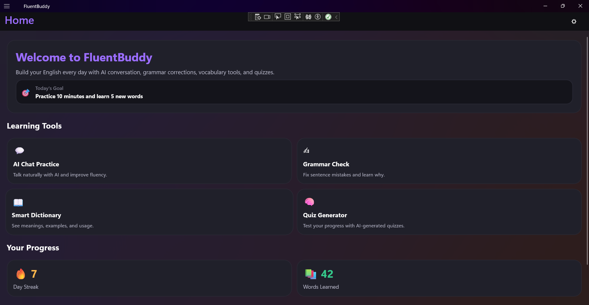
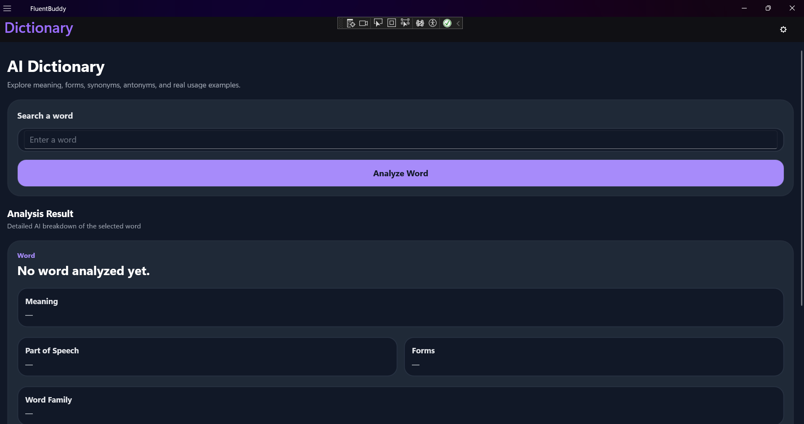
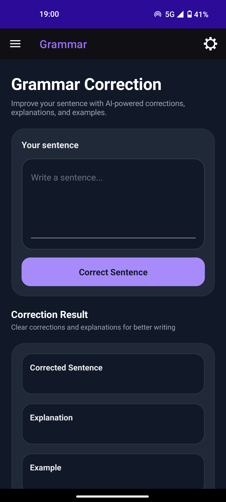
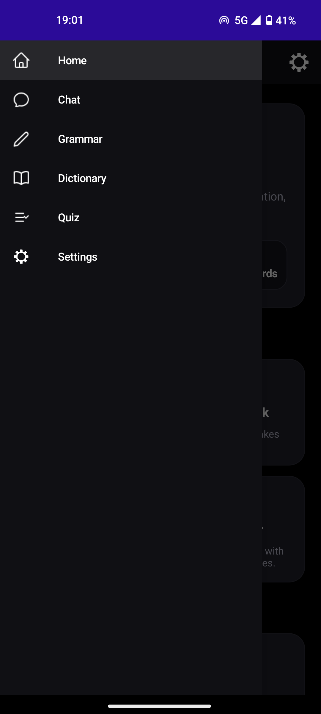
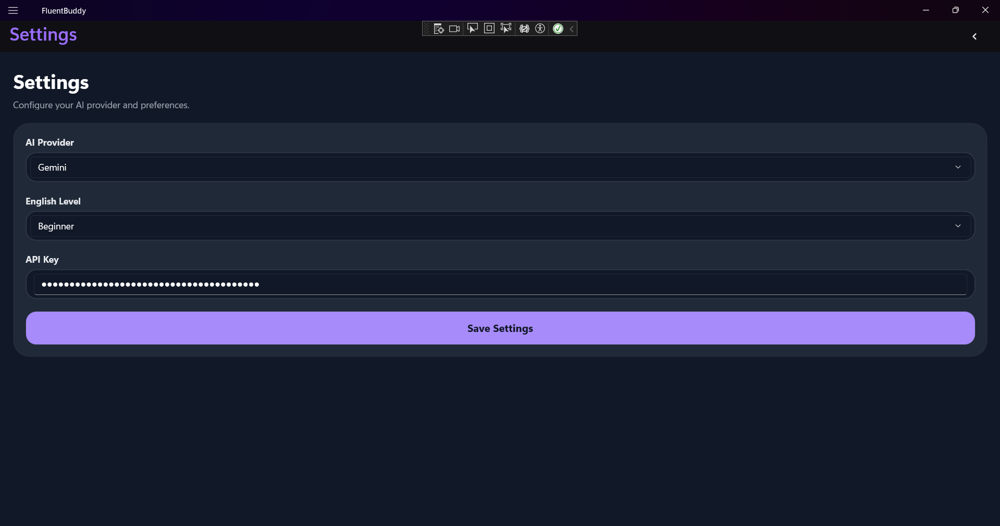

[](https://github.com/AlexanderSlivarov/FluentBuddy/stargazers)

[](https://github.com/AlexanderSlivarov/FluentBuddy/network)

[](https://github.com/AlexanderSlivarov/FluentBuddy/issues)

**Your intelligent companion for mastering languages and enhancing fluency.**

</div>

## 🛡️Author

Александър Сливаров

## 📖 Overview

FluentBuddy is a C# .NET application designed to assist users in their language learning journey. While the exact features are yet to be fully revealed by the codebase, its name suggests a focus on improving language fluency through interactive tools, tracking progress, or providing a structured learning environment. This project serves as a robust foundation for a desktop or console application built within the familiar and powerful .NET ecosystem.

## ✨ Features

-   🎯 **AI-Powered Learning Tools:** Interactive learning with AI-driven chat practice, grammar checks, and vocabulary building exercises.
-   ⚙️ **Personalized Settings:** Easily configure AI provider, English level, and other preferences directly from the settings page.
-   🧠 **Grammar Correction:** Get real-time grammar feedback with explanations and suggestions for improvement.
-   🎮 **Quiz Generator:** Generate AI-powered quizzes to test your learning progress and reinforce knowledge.
-   🔥 **Progress Tracking:** Track your daily streak, words learned, and overall language improvement through visual progress indicators.

## 🖥️ Screenshots

 

 

 

 

## 🛠️ Tech Stack

**Primary:**

[](https://docs.microsoft.com/en-us/dotnet/csharp/)

[](https://dotnet.microsoft.com/)

[](https://docs.microsoft.com/en-us/dotnet/maui)

**Development Tools:**

[](https://visualstudio.microsoft.com/)

[](https://www.nuget.org/)

## 🚀 Quick Start

### Prerequisites
-   **[.NET SDK](https://dotnet.microsoft.com/download)**: Version 6.0 or later recommended (check `FluentBuddy.csproj` for exact target framework).
-   **[Visual Studio](https://visualstudio.microsoft.com/downloads/)** (Optional but Recommended): For the best development experience with the `.sln` file.
-   **Git**: For cloning the repository.

### Installation

1.  **Clone the repository**
    ```bash
    git clone https://github.com/AlexanderSlivarov/FluentBuddy.git
    cd FluentBuddy
    ```

2.  **Open in Visual Studio**
    Open the `FluentBuddy.sln` file directly with Visual Studio. Visual Studio will automatically restore NuGet packages and prepare the solution.

    *(Alternatively, using the .NET CLI)*
    ```bash
    # Restore NuGet packages
    dotnet restore
    ```

3.  **Build the project**
    Build the solution within Visual Studio (Build > Build Solution) or using the .NET CLI:
    ```bash
    dotnet build
    ```

4.  **Run the application**
    *   **From Visual Studio:** Press `F5` or click the `Start` button to run the application in debug mode.
    *   **From .NET CLI:**
        ```bash
        dotnet run --project FluentBuddy/FluentBuddy.csproj
        ```
        *(Note: If `FluentBuddy` is a console application, this will execute it. If it's a desktop GUI application, this will launch the GUI.)*

## 📁 Project Structure

```
FluentBuddy/
├── .gitignore # Files and directories to be ignored by Git
├── FluentBuddy.sln # Visual Studio Solution file
├── FluentBuddy/ # Main project folder
├── FluentBuddy.csproj # C# project file defining settings and dependencies
├── Program.cs # Main entry point for the application
├── /Resources # Resources like images, icons, and styles
├── /Services # Services for AI, Gemini, OpenAI, etc.
│ ├── GeminiService.cs # Service for interacting with Gemini
│ ├── IAiService.cs # Service for AI functionality
│ ├── OpenAiService.cs # Service for OpenAI integration
│ └── SettingsService.cs # Service for handling settings
├── /Views # XAML files for the app’s UI
│ ├── ChatPage.xaml # Chat page UI
│ ├── DictionaryPage.xaml # Dictionary page UI
│ ├── GrammarPage.xaml # Grammar page UI
│ ├── HomePage.xaml # Home screen UI
│ ├── QuizPage.xaml # Quiz page UI
│ ├── SettingsPage.xaml # Settings page UI
│ ├── App.xaml # Main app entry point
│ ├── AppShell.xaml # Shell for navigation
│ ├── GlobalXmlns.cs # Global XML namespace definitions
│ └── MainPage.xaml # Main page UI
├── MauiProgram.cs # Entry point for the MAUI application
```

## ⚙️ Configuration

Application configuration can typically be managed via:
-   **`appsettings.json`**: For structured configuration (commonly used in .NET Core projects).
-   **Settings Page**: Configure your AI provider, English level, and API key directly in the application UI.

Here's a screenshot of the settings page where you can manage your configurations:

 

<!-- TODO: Add specific environment variables or config file details if known -->

## 🔧 Development

### Available Commands
The primary development workflow revolves around the .NET CLI and Visual Studio.

| Command         | Description                                     |

|-----------------|-------------------------------------------------|

| `dotnet restore`| Restores NuGet packages for the solution.       |

| `dotnet build`  | Compiles the project.                           |

| `dotnet run`    | Builds and runs the application.                |

| `dotnet test`   | Runs unit tests (if a test project exists).     |


### Development Workflow
1.  Open `FluentBuddy.sln` in Visual Studio.
2.  Make changes to the C# source files within the `FluentBuddy/` directory.
3.  Build and run the application using Visual Studio's debugger or `dotnet run`.

## 📞 Support & Contact

-   ✉︎ For any questions, feedback, or collaboration, feel free to reach out to me at:
-   **Email**: [stu2401321058@uni-plovdiv.bg](mailto:stu2401321058@uni-plovdiv.bg)

---

<div align="center">

**⭐ Star this repo if you find it helpful!**

</div>
